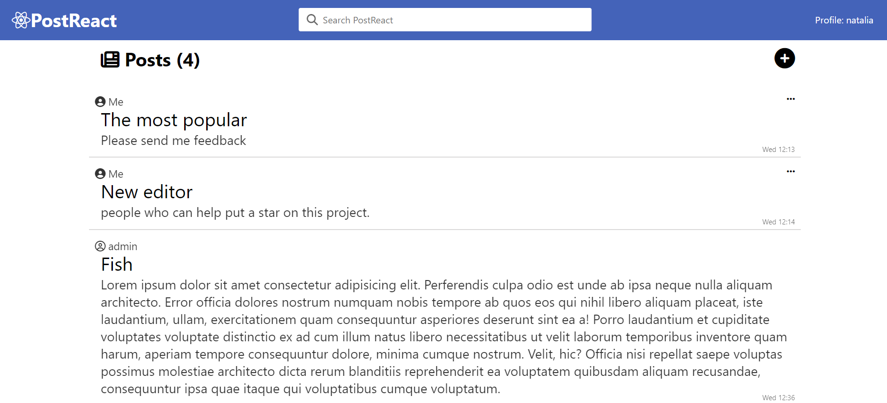

## Проект "PostReact"

### Описание проекта

Этот проект представляет собой веб-приложение с возможностью публикации контента, системы рейтингов, поиска, комментариев, системы upvote/downvote и административной панели для управления пользователями и удаления постов. Приложение использует микросервисную архитектуру и разворачивается локально с помощью Docker.

---

### Предпросмотр

<div>
	
	
</div>

---

### Функциональность

- **Публикация контента**: Пользователи могут создавать и редактировать посты.
- **Система рейтингов**: Пользователи могут ставить лайки и дизлайки постам.
- **Поиск**: Возможность поиска постов по ключевым словам и поиска постов по именам пользователей.
- **Комментарии**: Пользователи могут оставлять комментарии к постам.
- **Система upvote/downvote**: Пользователи могут голосовать за или против постов.
- **Административная панель**: Администраторы могут управлять пользователями и удалять посты.

### Технологии

-  Фронтенд библиотека для создания пользовательских интерфейсов.
-  Бэкенд фреймворк для создания веб-приложений и API.
-  Легковесная реляционная база данных.
-  Платформа для разработки, доставки и запуска приложений в контейнерах.
-  Веб-сервер для корректного перенаправления запросов.
-  Стандарт для создания токенов доступа.
-  Библиотека для хеширования паролей.
-  Среда выполнения JavaScript вне браузера.
-  Библиотека для выполнения HTTP-запросов.

### Установка и запуск проекта

1. **Клонирование репозитория**

   ```bash
   git clone https://github.com/yourusername/projectname.git
   cd projectname
   ```

2. **Настройка окружения**

   Измените файл `.env` в корневой директории проекта и замените следующие переменные окружения:

   ```plaintext
   SECRET_KEY=your_secret_key
   ADMIN_USERNAME=admin
   ADMIN_EMAIL=admin@example.com
   ADMIN_PASSWORD=123098
   ```

3. **Запуск Docker контейнеров**

   Убедитесь, что у вас установлен Docker и Docker Compose. Затем выполните команду:

   ```bash
   docker-compose up --build
   ```

4. **Открытие приложения**

   Откройте ваш браузер и перейдите по адресу `http://localhost:3000`.

### Структура проекта

- **frontend**: Директория с фронтенд кодом на React.
- **backend**: Директория с бэкенд кодом на Express.js.
- **services**: Директория с кодом микросервисов (комментарии, рейтинг и т.д.).
- **docker-compose.yml**: Файл конфигурации Docker Compose.
- **Dockerfile**: Dockerfile для создания контейнеров.

### Эндпоинты

#### Регистрация (порт 3000)

- **POST /register**: Регистрация нового пользователя.
- **POST /login**: Аутентификация пользователя.
- **GET /profile**: Получение информации о профиле.

#### Посты (порт 3001)

- **GET /posts/:id**: Получение информации о посте по ID.
- **GET /posts/search**: Поиск постов по заголовку.
- **GET /posts/search/user**: Поиск постов по имени пользователя.

#### Рейтинги (порт 3002)

- **GET /posts/:postId/rating**: Получение рейтинга поста.
- **POST /posts/:postId/like**: Лайк поста.
- **POST /posts/:postId/dislike**: Дизлайк поста.

#### Комментарии (порт 3003)

- **GET /posts/:postId/comments**: Получение комментариев для поста.
- **POST /posts/:postId/comments**: Добавление нового комментария к посту.

#### Администрирование (порт 3004)

- **GET /users**: Получение всех пользователей.
- **DELETE /posts/:id**: Удаление поста по ID.

### Поисковая функциональность

Поисковая функциональность позволяет пользователям искать посты по заголовку и искать посты по имени пользователя.

- **Поиск по заголовку**: Пользователи могут искать посты, вводя ключевые слова в строку поиска. Поиск вернет посты, заголовки которых содержат введенные ключевые слова.

- **Поиск по имени пользователя**: Пользователи могут искать посты, вводя имя пользователя, предшествуемое символом "@", в строку поиска. Поиск вернет посты, созданные пользователями, имена которых содержат введенную подстроку.

### Авторизация и Роли

Для выполнения административных действий необходимо быть аутентифицированным и иметь роль "admin".
Для настройки пользователя "admin" нужно перейти в `.env` и заменить переменные:

```
ADMIN_USERNAME=admin
ADMIN_EMAIL=admin@example.com
ADMIN_PASSWORD=123098
```

### Лицензия

Этот проект лицензирован на условиях лицензии MIT. Подробности см. в файле [LICENSE](../LICENSE).
